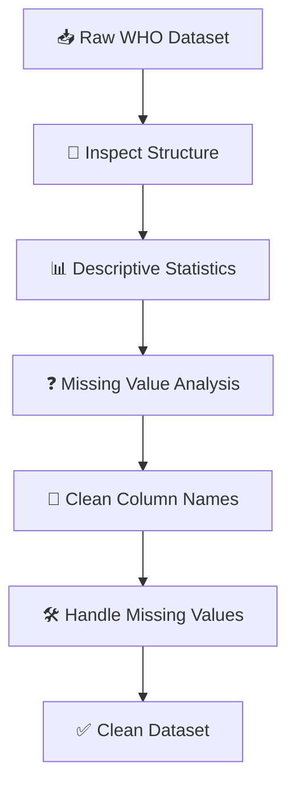
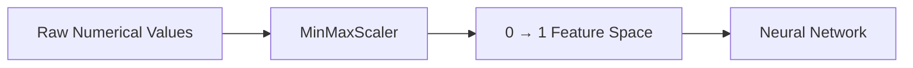
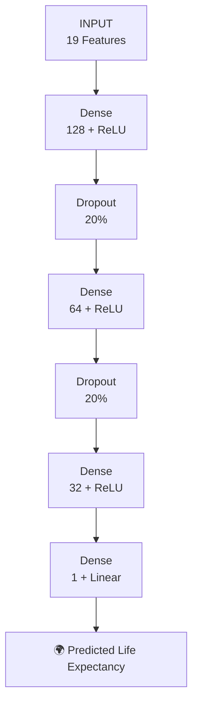
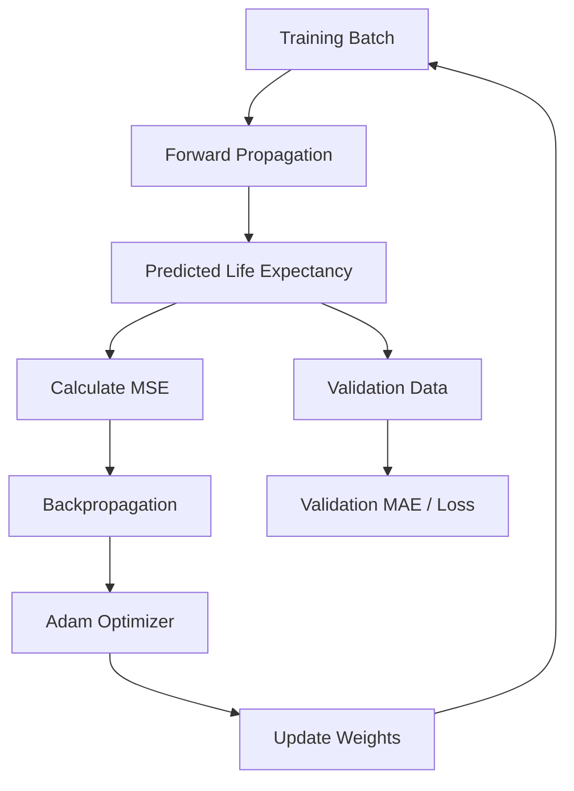
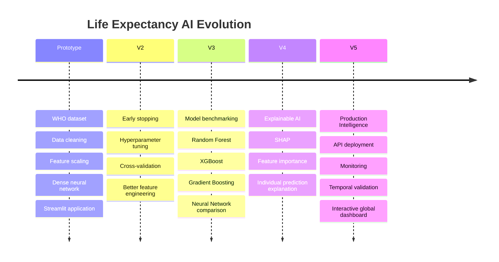

# 🌍 LIFE EXPECTANCY AI

### Deep Learning–Powered Global Life Expectancy Prediction

<p align="center">


</p>

<p align="center">
<b>Turning health, demographic and economic indicators into a data-driven estimate of life expectancy.</b>
</p>

---

# 🧭 Project Overview

**Life Expectancy AI** is an end-to-end deep learning regression system built using the **WHO Life Expectancy dataset**.

The model learns relationships between health, mortality, education, economic and demographic indicators to predict a country's **life expectancy**.

This project covers the complete pipeline:

```text
🌍 DATA
   ↓
🧹 CLEAN
   ↓
🧬 ENGINEER
   ↓
📏 SCALE
   ↓
🧠 DEEP LEARNING
   ↓
📊 EVALUATE
   ↓
💾 SERIALIZE
   ↓
🌐 DEPLOY
```

The final system combines a **TensorFlow/Keras neural network** with a **Streamlit prediction interface**.

---

# ⚡ PROJECT SNAPSHOT

| Component            | Implementation               |
| -------------------- | ---------------------------- |
| Domain               | Global Health / Data Science |
| Problem              | Regression                   |
| Target               | `Life expectancy`            |
| Dataset Records      | **2,938**                    |
| Cleaned Records      | **2,928**                    |
| Original Columns     | **22**                       |
| Model Input Features | **19**                       |
| Train Samples        | **2,342**                    |
| Test Samples         | **586**                      |
| Validation Split     | **20% of training data**     |
| Neural Network       | Dense Feed-Forward           |
| Optimizer            | Adam                         |
| Loss                 | Mean Squared Error           |
| Main Metric          | Mean Absolute Error          |
| Epochs               | **100**                      |
| Batch Size           | **32**                       |
| Deployment           | Streamlit                    |

---

# 🌎 THE PROBLEM

Life expectancy is influenced by a complex combination of factors.

```text
             🌍 LIFE EXPECTANCY
                     │
      ┌──────────────┼──────────────┐
      ▼              ▼              ▼
   🏥 HEALTH       💰 ECONOMY    🎓 EDUCATION
      │              │              │
      ▼              ▼              ▼
 Mortality        GDP             Schooling
 HIV/AIDS         Spending        Income
 Immunization     Expenditure     Resources
      │              │              │
      └──────────────┼──────────────┘
                     ▼
              🧠 NEURAL NETWORK
                     │
                     ▼
              📈 LIFE EXPECTANCY
```

The objective is not simply to examine one variable, but to learn the combined relationship between these indicators.

---

# 🧠 CORE IDEA


---

# 📊 DATASET

The notebook downloads the dataset using KaggleHub:

```python
path = kagglehub.dataset_download(
    "kumarajarshi/life-expectancy-who"
)
```

The source dataset contains **2,938 records and 22 columns**.

### Major feature groups

```text
┌──────────────────────────────────────────────────────┐
│                LIFE EXPECTANCY DATA                  │
├──────────────────────────────────────────────────────┤
│                                                      │
│ 🏥 HEALTH                                             │
│   Adult Mortality                                    │
│   Infant Deaths                                      │
│   HIV/AIDS                                           │
│   Hepatitis B                                        │
│   Polio                                              │
│   Diphtheria                                         │
│   Measles                                            │
│                                                      │
│ 🍎 LIFESTYLE                                          │
│   Alcohol                                            │
│   BMI                                                │
│                                                      │
│ 💰 ECONOMY                                            │
│   GDP                                                │
│   Percentage Expenditure                             │
│   Total Expenditure                                  │
│   Income Composition of Resources                    │
│                                                      │
│ 👶 DEMOGRAPHICS                                       │
│   Population                                         │
│   Under-five Deaths                                  │
│   Thinness 1–19 years                                │
│   Thinness 5–9 years                                 │
│                                                      │
│ 🎓 EDUCATION                                          │
│   Schooling                                          │
│                                                      │
│ 🌐 STATUS                                             │
│   Developed / Developing                             │
│                                                      │
└──────────────────────────────────────────────────────┘
```

---

# 🔍 DATA QUALITY PIPELINE

The project begins by inspecting:

* Data types
* Non-null counts
* Descriptive statistics
* Missing values
* Column naming consistency



---

# 🧹 DATA CLEANING

The notebook removes leading/trailing spaces from column names:

```python
df.columns = df.columns.str.strip()
```

### Missing-value strategy

The target variable is treated separately:

```text
Life expectancy
       │
       ▼
Missing?
   │
   ├── YES → Remove row
   │
   └── NO  → Keep
```

For other numerical columns:

```text
Missing numerical value
          │
          ▼
Column mean
          │
          ▼
Imputed value
```

After dropping rows with missing life expectancy, the dataset contains:

**2,928 usable records.**

---

# 🔤 CATEGORICAL FEATURE ENCODING

The dataset contains a categorical `Status` feature:

```text
Developed
Developing
```

It is converted using one-hot encoding:

```python
df = pd.get_dummies(
    df,
    columns=['Status'],
    drop_first=True,
    dtype=int
)
```

This produces:

```text
Status_Developing

Developed  → 0
Developing → 1
```

---

# 🗑️ FEATURE SELECTION

For this initial deep learning model, the notebook removes:

```text
Country
Year
```

The resulting feature space contains:

**19 input features.**

```text
22 Original Columns
       │
       ├── Life expectancy → 🎯 Target
       ├── Country         → Removed
       └── Year            → Removed
       
       ↓

19 MODEL INPUT FEATURES
```

---

# 📏 FEATURE SCALING

Neural networks can benefit from normalized numerical inputs.

The project uses:

```python
MinMaxScaler()
```

Numerical features are transformed into the **0–1 range**.



---

# ✂️ TRAIN / TEST SPLIT

The cleaned dataset is divided using:

```python
train_test_split(
    X,
    y,
    test_size=0.2,
    random_state=42
)
```

Result:

```text
                 2,928 RECORDS
                       │
              ┌────────┴────────┐
              │                 │
              ▼                 ▼
        🟦 TRAINING         🟧 TESTING
          2,342                586
              │
              ▼
        20% VALIDATION
```

The training set is further divided internally using a **20% validation split** during model training.

---

# 🧠 DEEP LEARNING ARCHITECTURE

The project uses a fully connected neural network.

```text
                 INPUT
              19 FEATURES
                   │
                   ▼
        ┌────────────────────┐
        │ Dense Layer        │
        │ 128 Neurons        │
        │ ReLU               │
        └──────────┬─────────┘
                   │
                   ▼
        ┌────────────────────┐
        │ Dropout            │
        │ 20%                │
        └──────────┬─────────┘
                   │
                   ▼
        ┌────────────────────┐
        │ Dense Layer        │
        │ 64 Neurons         │
        │ ReLU               │
        └──────────┬─────────┘
                   │
                   ▼
        ┌────────────────────┐
        │ Dropout            │
        │ 20%                │
        └──────────┬─────────┘
                   │
                   ▼
        ┌────────────────────┐
        │ Dense Layer        │
        │ 32 Neurons         │
        │ ReLU               │
        └──────────┬─────────┘
                   │
                   ▼
        ┌────────────────────┐
        │ Output             │
        │ 1 Neuron           │
        │ Linear             │
        └──────────┬─────────┘
                   │
                   ▼
          🌍 LIFE EXPECTANCY
```

---

# 🧬 MODEL ARCHITECTURE MAP



---

# ⚙️ TRAINING CONFIGURATION

```text
┌────────────────────────────────────┐
│         TRAINING CONFIG            │
├────────────────────────────────────┤
│ Optimizer      → Adam              │
│ Loss           → MSE               │
│ Metric         → MAE               │
│ Epochs         → 100               │
│ Batch Size     → 32                │
│ Validation     → 20%               │
│ Dropout        → 20%               │
└────────────────────────────────────┘
```

### Why regression?

Life expectancy is a continuous numerical quantity rather than a category.

Therefore:

```text
Classification ❌

       ↓

Regression ✅

       ↓

Predicted numerical value
```

---

# 🔥 TRAINING PROCESS



The model is trained for **100 epochs** with a batch size of **32**.

---

# 📈 MODEL PERFORMANCE

The trained model is evaluated on the unseen test set.

### Final test metrics recorded in the notebook

| Metric          |           Result |
| --------------- | ---------------: |
| Test MSE / Loss |      **12.1065** |
| Test MAE        | **2.5609 years** |

### Interpretation

The reported test MAE of **2.5609** means the model's predictions differ from the actual life expectancy by approximately **2.56 years on average** on the test set.

> This is the result recorded by the uploaded notebook and should be interpreted within the dataset and preprocessing methodology used here.

---

# 📊 TRAINING VISUALIZATION

The notebook tracks two important learning curves:

### Loss

```text
TRAINING LOSS
      │
      │╲
      │ ╲
      │  ╲____
      │       ╲___
      └──────────────────→ Epoch
```

### Mean Absolute Error

```text
TRAINING MAE
      │
      │╲
      │ ╲
      │  ╲____
      │       ╲___
      └──────────────────→ Epoch
```

The repository can showcase the actual generated plots:

```text
assets/
└── training/
    ├── loss_curve.png
    └── mae_curve.png
```

Then render them:

<p align="center">

</p>

<p align="center">

</p>

---

# 🧠 WHAT DOES THE NETWORK LEARN?

The model does not use manually defined rules such as:

```text
GDP ↑ → Life expectancy ↑
```

Instead, it learns nonlinear relationships between multiple variables.

```text
Health ──────────┐
                 │
Education ───────┤
                 │
Economy ─────────┼──────► 🧠 NEURAL NETWORK
                 │                 │
Mortality ───────┤                 ▼
                 │          Learned Patterns
Population ──────┘                 │
                                   ▼
                            Life Expectancy
```

This makes the project a useful example of **multivariate deep learning regression**.

---

# 🌐 FROM MODEL TO APPLICATION

The project also creates a Streamlit interface for interactive prediction.


---

# 🖥️ APPLICATION EXPERIENCE

The application is designed around a simple concept:

```text
        🌍 LIFE EXPECTANCY PREDICTOR
                    │
                    ▼
      ┌──────────────────────────┐
      │     INPUT INDICATORS     │
      ├──────────────────────────┤
      │ Adult Mortality          │
      │ Infant Deaths            │
      │ Alcohol                  │
      │ GDP                      │
      │ Population               │
      │ BMI                      │
      │ HIV/AIDS                 │
      │ Schooling                │
      │ Immunization             │
      │ Economic Indicators      │
      └────────────┬─────────────┘
                   │
                   ▼
              [ PREDICT ]
                   │
                   ▼
      ┌──────────────────────────┐
      │  📈 Estimated Life       │
      │     Expectancy           │
      └──────────────────────────┘
```

---

# 📸 VISUAL SHOWCASE

For a polished GitHub repository, use a dedicated visual directory:

```text
assets/
│
├── hero.png
│
├── dataset/
│   ├── overview.png
│   └── correlation.png
│
├── preprocessing/
│   ├── missing-values.png
│   └── scaling.png
│
├── model/
│   └── architecture.png
│
├── training/
│   ├── loss_curve.png
│   └── mae_curve.png
│
└── application/
    ├── dashboard.png
    ├── inputs.png
    └── prediction.png
```

### Application Preview

<p align="center">

</p>

### Prediction Interface

<p align="center">

</p>

### Model Architecture

<p align="center">

</p>

---

# 💾 MODEL ARTIFACTS

The notebook saves the trained components required for inference.

```text
                  MODEL PACKAGE
                       │
          ┌────────────┴────────────┐
          ▼                         ▼
   🧠 Neural Network            📏 Scaler
          │                         │
          ▼                         ▼
life_expectancy_model.keras    scaler.pkl
          │                         │
          └────────────┬────────────┘
                       ▼
                🌐 STREAMLIT APP
```

### Saved files

```text
life_expectancy_model.keras
scaler.pkl
app.py
```

The model is stored using Keras' native format, while the fitted `MinMaxScaler` is serialized using pickle.

---

# 📁 REPOSITORY STRUCTURE

```text
Life-Expectancy-AI/
│
├── 📓 Life_Expectancy_(WHO).ipynb
│
├── 🧠 life_expectancy_model.keras
├── ⚙️ scaler.pkl
├── 🌐 app.py
│
├── 📂 assets/
│   ├── hero.png
│   ├── dataset/
│   ├── preprocessing/
│   ├── model/
│   ├── training/
│   └── application/
│
├── 📄 requirements.txt
└── 📖 README.md
```

---

# 🚀 RUN LOCALLY

### 1. Clone the repository

```bash
git clone https://github.com/<your-username>/Life-Expectancy-AI.git
cd Life-Expectancy-AI
```

### 2. Install dependencies

```bash
pip install tensorflow pandas numpy scikit-learn streamlit
```

### 3. Verify model files

Make sure these files are available:

```text
life_expectancy_model.keras
scaler.pkl
```

### 4. Start Streamlit

```bash
streamlit run app.py
```

---

# 🧪 PREDICTION FLOW

```text
USER INPUT
    │
    ▼
┌─────────────────────┐
│ Health Indicators   │
│ Economic Indicators │
│ Demographic Data    │
│ Education           │
└──────────┬──────────┘
           │
           ▼
    MIN-MAX SCALING
           │
           ▼
      🧠 NEURAL NET
           │
           ▼
    NUMERICAL OUTPUT
           │
           ▼
┌─────────────────────┐
│ Life Expectancy     │
│ Prediction          │
└─────────────────────┘
```

---

# 🛠️ TECHNOLOGY STACK

```text
                 LIFE EXPECTANCY AI
                         │
       ┌─────────────────┼─────────────────┐
       ▼                 ▼                 ▼
     DATA              MODEL             APP
       │                 │                 │
    Pandas           TensorFlow        Streamlit
    NumPy             Keras             Python
       │                 │                 │
       └─────────────────┼─────────────────┘
                         ▼
                  END-TO-END AI
```

| Layer           | Technology         |
| --------------- | ------------------ |
| Programming     | Python             |
| Data Processing | Pandas / NumPy     |
| Preprocessing   | Scikit-learn       |
| Scaling         | MinMaxScaler       |
| Deep Learning   | TensorFlow / Keras |
| Visualization   | Matplotlib         |
| Deployment      | Streamlit          |
| Model Storage   | Keras `.keras`     |
| Scaler Storage  | Pickle             |

---

# 🔮 ROADMAP



---

# 🚀 FUTURE VISION

The next version can evolve from a simple predictor into a **Global Health Intelligence System**.

```text
                 🌍 GLOBAL HEALTH AI
                         │
        ┌────────────────┼────────────────┐
        ▼                ▼                ▼
  LIFE EXPECTANCY   HEALTH RISK       ECONOMIC
    PREDICTION       ANALYTICS        ANALYSIS
        │                │                │
        └────────────────┼────────────────┘
                         ▼
                  📊 HEALTH DASHBOARD
                         │
                         ▼
                 DATA-DRIVEN INSIGHTS
```

Potential extensions:

* 🌍 Country-level comparison
* 📈 Historical trend analysis
* 🏥 Health indicator dashboards
* 🔬 Feature importance
* 🤖 Explainable AI
* 📊 Interactive global maps
* 📅 Future life expectancy forecasting
* 🔌 REST API
* ☁️ Cloud deployment

---

# ⚠️ IMPORTANT LIMITATIONS

This project is a **research/educational prototype**, not a clinical or policy decision-making system.

The model is trained on historical observational data and should not be interpreted as establishing causal relationships between health indicators and life expectancy.

The current implementation also drops `Country` and `Year`, meaning the model does not explicitly learn country identity or temporal trends.

The reported performance is based on the test split used in the notebook:

**MSE: 12.1065**
**MAE: 2.5609 years**

Further validation, temporal testing and model comparison would be appropriate before real-world deployment.

---

# 📚 KEY LEARNING OUTCOMES

### Data Science

* Real-world dataset exploration
* Missing-value analysis
* Data cleaning
* Descriptive statistics
* Feature preprocessing

### Machine Learning

* Train/test splitting
* Feature scaling
* Categorical encoding
* Regression evaluation

### Deep Learning

* Dense neural networks
* ReLU activation
* Dropout regularization
* Adam optimization
* MSE loss
* MAE evaluation

### Deployment

* Keras model serialization
* Scaler persistence
* Streamlit application development
* Interactive prediction workflow

---

# 🏆 PROJECT TAKEAWAY

```text
         RAW HEALTH DATA
                │
                ▼
        🧹 DATA QUALITY
                │
                ▼
        🧬 FEATURES
                │
                ▼
          📏 SCALING
                │
                ▼
        🧠 DEEP LEARNING
                │
                ▼
          📊 EVALUATION
                │
                ▼
          🌐 APPLICATION
                │
                ▼
       🌍 LIFE EXPECTANCY
```

**The objective is simple: transform complex health and socioeconomic data into an interpretable numerical prediction using deep learning.**

---

# 👨‍💻 AUTHOR

## Aravind

**AI & Data Science Student | Machine Learning & Deep Learning**

> *Building practical AI systems from data to deployment.*

---

<p align="center">

🌍 **DATA** → 🧠 **INTELLIGENCE** → 📈 **PREDICTION**

<br><br>

⭐ **If you found this project useful, consider starring the repository.**

</p>
